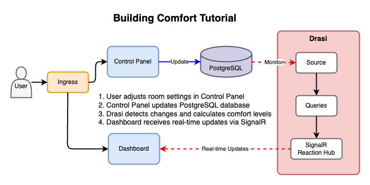

# Building Comfort Tutorial

This tutorial demonstrates Drasi's real-time change detection capabilities through a building management scenario.

You'll see Drasi in action in a scenario where:
- A **Control Panel** allows you to adjust room conditions (temperature, humidity, CO2)
- Measurements are persisted in a Postgres instance
- Changes to PostgreSQL are instantly detected by **Drasi**
- A **Dashboard** displays real-time comfort levels and alerts via SignalR

Follow along the tutorial instructions on [our website here](https://drasi.io/tutorials/building-comfort/).



The setup includes:
- PostgreSQL database with building data
- Control Panel (React + Python API)
- Real-time Dashboard (React + SignalR)
- Drasi platform with continuous queries
- Demo page showing both apps side-by-side
- For convenience, everything is accessible through a Traefik Ingress

## Setup in GitHub Codespaces

1. Open this repository in GitHub Codespaces
2. Wait for automatic setup to complete (~5 minutes)
3. When port 80 notification appears, click "Open in Browser"
4. Access the applications via the forwarded URL:
   - Demo: `https://<your-codespace-url>/`
   - Control Panel: `https://<your-codespace-url>/control-panel`
   - Dashboard: `https://<your-codespace-url>/dashboard`
   - Control Panel API Docs: `https://<your-codespace-url>/control-panel/docs`

### Pre-configured for you:
- k3d cluster with Traefik ingress
- Drasi platform installed
- PostgreSQL database deployed and populated
- All applications running (Control Panel, Dashboard, Demo)

### Troubleshooting:
- Check the **PORTS** tab in VS Code to see forwarded ports
- Ensure port 80 shows as forwarded
- The URL format is: `https://<codespace-name>-80.app.github.dev`
- If using HTTPS URLs doesn't work, try the HTTP version
- Make sure the port visibility is set to "Public" if sharing the URL

## Setup in VS Code Dev Container

1. Prerequisites:
   - Docker Desktop
   - VS Code with Dev Containers extension

2. Steps:
   - Open VS Code
   - Open this folder: `tutorial/building-comfort`
   - Click "Reopen in Container" when prompted
   - Wait for setup to complete (~5 minutes)
   - Access applications at:
     - Demo: http://localhost/
     - Control Panel: http://localhost/control-panel
     - Dashboard: http://localhost/dashboard
     - Control Panel API Docs: http://localhost/control-panel/docs

### Pre-configured for you:
- k3d cluster with Traefik ingress
- Drasi platform installed
- PostgreSQL database deployed and populated
- All applications running (Control Panel, Dashboard, Demo)

### Troubleshooting:
- Check the **PORTS** tab in VS Code to verify port 80 is forwarded
- If not accessible, manually forward port 80 in the PORTS tab
- Applications are already running - no need to start them manually
- Logs can be viewed with `kubectl logs deployment/<app-name>`

## Setup your own Local k3d Cluster

1. Prerequisites:
   - Docker
   - kubectl
   - k3d (optional - script will install if needed)

2. Run setup:
   ```bash
   cd tutorial/building-comfort
   ./scripts/setup-tutorial.sh
   ```

3. Choose setup mode:
   - Select "1" for full k3d setup (recommended)
   - Follow prompts to create cluster and deploy apps

**The script will:**
- Install k3d if not present
- Create k3d cluster 'drasi-tutorial' with Traefik
- Install and initialize Drasi platform
- Deploy PostgreSQL with sample building data
- Deploy all applications (Control Panel, Dashboard, Demo)
- Configure ingress routing for web access

4. Access applications:
   - Demo: http://localhost/
   - Control Panel: http://localhost/control-panel
   - Dashboard: http://localhost/dashboard
   - Control Panel API Docs: http://localhost/control-panel/docs

### Cleanup

```bash
./scripts/cleanup-tutorial.sh
```

Follow prompts to remove:
1. Tutorial resources
2. Drasi installation (optional)
3. k3d cluster (optional)

## Development Scripts

For local development and testing changes:

**`./scripts/dev-reload.sh <app-name>`** - Build and deploy your local changes
- Rebuilds the Docker image from your local source code
- Imports it into the k3d cluster
- Updates the deployment to use your custom image
- Changes are visible immediately after rollout completes
- Example: `./scripts/dev-reload.sh control-panel`
- Available apps: `control-panel`, `dashboard`, `demo`

**`./scripts/reset-images.sh <app-name>`** - Revert to official images
- Restores the original pre-built images from GitHub Container Registry
- Use after testing to return to the stable version
- Example: `./scripts/reset-images.sh all`
- Supports resetting individual apps or all at once

**Making Changes:**
1. Edit source code in the app directory (e.g., `control-panel/`)
2. Run `./scripts/dev-reload.sh control-panel`
3. Refresh your browser to see changes
4. When done, run `./scripts/reset-images.sh control-panel` to restore