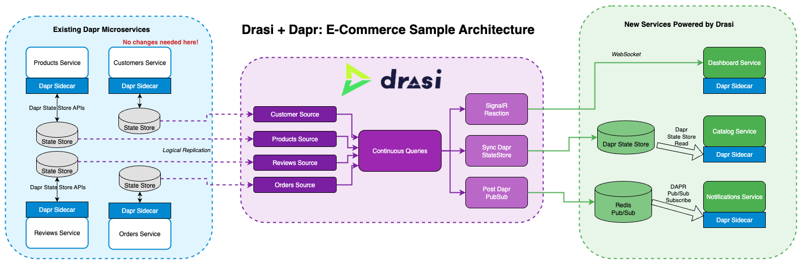

# Dapr + Drasi Tutorial

This tutorial demonstrates how Drasi supercharges Dapr applications with real-time data change processing capabilities across multiple microservices. Originally presented at the Dapr Community Call, this scenario showcases three powerful Drasi reactions that solve common challenges in distributed microservice architectures.

You'll see Drasi in action where:
- **Four Dapr microservices** (Products, Customers, Orders, Reviews) manage their own state stores
- **Drasi monitors** all state stores via logical replication with zero impact on services
- **Three Drasi-powered services** demonstrate real-time capabilities:
  - **Catalog Service**: Materialized view combining products and review statistics
  - **Dashboard**: Real-time monitoring of Gold customer delays and stock issues
  - **Notifications**: Intelligent business events for inventory thresholds

Follow along the tutorial instructions on [our website here](https://drasi.io/tutorials/dapr/).



## What You'll Learn

- How Drasi monitors Dapr state stores without impacting service performance
- Creating materialized views across multiple services with Sync Dapr State Store reaction
- Building real-time dashboards with SignalR reaction
- Generating intelligent business events with Post Dapr Pub/Sub reaction
- Running complex queries across distributed data in real-time

## Setup in GitHub Codespaces

1. Open this repository in GitHub Codespaces
2. Wait for automatic setup to complete (~5 minutes)
3. When port 80 notification appears, click "Open in Browser"
4. Deploy Drasi components:
   ```bash
   kubectl apply -f drasi/sources/
   kubectl apply -f drasi/queries/
   kubectl apply -f drasi/reactions/
   ```
5. Access the applications via the forwarded URL:
   - Catalog UI: `https://<your-codespace>.app.github.dev/catalogue-service`
   - Dashboard: `https://<your-codespace>.app.github.dev/dashboard`
   - Notifications: `https://<your-codespace>.app.github.dev/notifications-service`
   - Products API: `https://<your-codespace>.app.github.dev/products-service/products`
   - Customers API: `https://<your-codespace>.app.github.dev/customers-service/customers`
   - Orders API: `https://<your-codespace>.app.github.dev/orders-service/orders`
   - Reviews API: `https://<your-codespace>.app.github.dev/reviews-service/reviews`

### Pre-configured for you:
- k3d cluster with Traefik ingress
- Drasi platform installed (includes Dapr)
- PostgreSQL databases deployed for each service
- Redis deployed for notifications
- All services running with initial data loaded

### Troubleshooting:
- Check the **PORTS** tab in VS Code to see forwarded ports
- Ensure port 80 shows as forwarded
- The URL format is: `https://<codespace-name>.app.github.dev`
- If using HTTPS URLs doesn't work, try the HTTP version
- Make sure the port visibility is set to "Public" if sharing the URL

## Setup in VS Code Dev Container

1. Prerequisites:
   - Docker Desktop
   - VS Code with Dev Containers extension

2. Steps:
   - Open VS Code
   - Open this folder: `tutorial/dapr`
   - Click "Reopen in Container" when prompted
   - Wait for setup to complete (~5 minutes)
   - Deploy Drasi components:
     ```bash
     kubectl apply -f drasi/sources/
     kubectl apply -f drasi/queries/
     kubectl apply -f drasi/reactions/
     ```
   - Access applications at:
     - Catalog UI: http://localhost:8123/catalogue-service
     - Dashboard: http://localhost:8123/dashboard
     - Notifications: http://localhost:8123/notifications-service
     - Products API: http://localhost:8123/products-service/products
     - Customers API: http://localhost:8123/customers-service/customers
     - Orders API: http://localhost:8123/orders-service/orders
     - Reviews API: http://localhost:8123/reviews-service/reviews

### Pre-configured for you:
- k3d cluster with Traefik ingress on port 8123
- Drasi platform installed (includes Dapr)
- PostgreSQL databases deployed for each service
- Redis deployed for notifications
- All services running with initial data loaded

### Troubleshooting:
- Check the **PORTS** tab in VS Code to verify port 8123 is forwarded
- If not accessible, manually forward port 8123 in the PORTS tab
- Applications are already running - no need to start them manually
- Logs can be viewed with `kubectl logs deployment/<app-name>`

## Setup your own Local k3d Cluster

### Prerequisites:
- Docker
- kubectl
- k3d
- Drasi CLI

### Installation Instructions:
- **kubectl**: https://kubernetes.io/docs/tasks/tools/
- **k3d**: https://k3d.io/#installation
- **Drasi CLI**: https://drasi.io/reference/command-line-interface/#get-the-drasi-cli

### Setup Steps:

1. **Navigate to the tutorial directory**
   ```bash
   cd tutorial/dapr
   ```

2. **Run the setup script**
   ```bash
   # For Linux/Mac:
   ./scripts/setup-tutorial.sh
   
   # For Windows PowerShell:
   ./scripts/setup-tutorial.ps1
   ```

3. **Deploy Drasi components**
   ```bash
   kubectl apply -f drasi/sources/
   kubectl apply -f drasi/queries/
   kubectl apply -f drasi/reactions/
   ```

4. **Access the applications**
   - Catalog UI: http://localhost:8123/catalogue-service
   - Dashboard: http://localhost:8123/dashboard
   - Notifications: http://localhost:8123/notifications-service
   - Products API: http://localhost:8123/products-service/products
   - Customers API: http://localhost:8123/customers-service/customers
   - Orders API: http://localhost:8123/orders-service/orders
   - Reviews API: http://localhost:8123/reviews-service/reviews

## Running the Demos

After setup is complete and Drasi components are deployed, explore the three demo scenarios:

### Demo 1: Product Catalog Service
```bash
cd demo
./demo-catalogue-service.sh
```

This demo shows:
- How Drasi maintains a materialized view combining products and review statistics
- Real-time updates when reviews are added or products change
- No polling or API orchestration needed

### Demo 2: Real-Time Dashboard
```bash
cd demo
./demo-dashboard-service.sh
```

This demo shows:
- Monitoring Gold customer orders that are delayed
- Detecting at-risk orders that can't be fulfilled due to stock
- Real-time WebSocket updates via SignalR

### Demo 3: Intelligent Notifications
```bash
cd demo
./demo-notifications-service.sh
```

This demo shows:
- Different alerts for low stock (< 20 units) vs critical stock (< 5 units)
- Business event transformation from raw database changes
- Event-driven workflows via Dapr pub/sub

## Architecture Overview

### Core Dapr Services
Each service runs with a Dapr sidecar and uses PostgreSQL as its state store:

- **Products Service** (`/products-service`): Manages product inventory
- **Customers Service** (`/customers-service`): Handles customer tiers
- **Orders Service** (`/orders-service`): Processes customer orders
- **Reviews Service** (`/reviews-service`): Manages product reviews

### Drasi Components

#### Sources
Drasi sources monitor the PostgreSQL databases backing the Dapr state stores via logical replication:
- `products-source`: Monitors products database
- `customers-source`: Monitors customers database
- `orders-source`: Monitors orders database
- `reviews-source`: Monitors reviews database

#### Continuous Queries
Written in Cypher, these queries detect patterns across services:
- `product-catalogue`: Joins products with review statistics
- `delayed-gold-orders`: Detects Gold customers with stuck orders
- `at-risk-orders`: Finds orders that can't be fulfilled
- `low-stock-event`: Products below 20 units
- `critical-stock-event`: Products below 5 units

#### Reactions
- **Sync Dapr State Store**: Updates catalog service's materialized view
- **SignalR**: Powers real-time dashboard updates
- **Post Dapr Pub/Sub**: Publishes intelligent business events

### Drasi-Powered Services

- **Catalog Service** (`/catalogue-service`): Reads from Drasi-maintained materialized view
- **Dashboard** (`/dashboard`): Connects to SignalR for real-time updates
- **Notifications** (`/notifications-service`): Subscribes to Drasi-generated events

## Utility Scripts

### Reload Services (Pull Latest Images)
```bash
# Linux/Mac:
./scripts/dev-reload.sh

# Windows PowerShell:
./scripts/dev-reload.ps1
```

### Reset Images (Force Fresh Pull)
```bash
# Linux/Mac:
./scripts/reset-images.sh

# Windows PowerShell:
./scripts/reset-images.ps1
```

### Complete Cleanup
```bash
# Linux/Mac:
./scripts/cleanup-tutorial.sh

# Windows PowerShell:
./scripts/cleanup-tutorial.ps1
```

## Troubleshooting

### Check Service Status
```bash
kubectl get pods
kubectl get deployments
```

### View Drasi Components
```bash
drasi list sources
drasi list queries
drasi list reactions
```

### Common Issues

**Services not accessible:**
- Check if k3d cluster is running: `k3d cluster list`
- Verify services are healthy: `kubectl get pods`
- For local setup, ensure you're using http://localhost:8123 (not https)
- For Codespaces, check the PORTS tab for the correct URL

**No data in catalog:**
- Verify Drasi sources are deployed: `kubectl get drasissource`
- Check Drasi query status: `drasi describe query product-catalogue`
- Ensure initial data was loaded during setup

**Dashboard not updating:**
- Verify SignalR reaction is running: `drasi describe reaction signalr-reaction`
- Check browser console for WebSocket connection errors
- Ensure the SignalR ingress is deployed: `kubectl get ingress signalr`

**Notifications not received:**
- Check Redis is running: `kubectl get statefulset notifications-redis`
- Verify pub/sub component: `kubectl get component.dapr.io notifications-pubsub`
- Check notifications service logs: `kubectl logs deployment/notifications`

## Learn More

- **Drasi Documentation**: https://drasi.io
- **Dapr Documentation**: https://docs.dapr.io
- **Tutorial Walkthrough**: https://drasi.io/tutorials/dapr/
- **Dapr Community Call Recording**: [Watch on YouTube](https://www.youtube.com/watch?v=S-ImhYfLplM&t=90s)